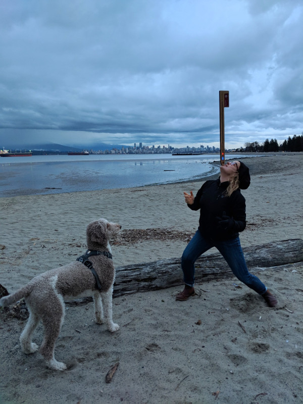
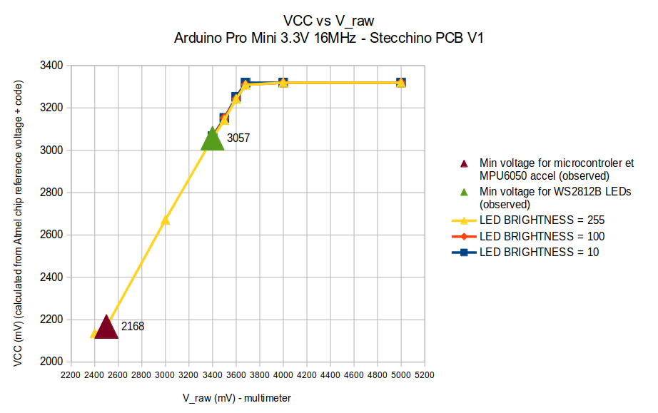
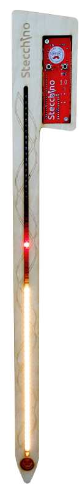

***
Stecchino is an home-made game where you need to balance a stick-like device at the tip of your fingers. The longer you can keep it balanced the more LEDs are lit on the Stecchino device. Can you do better than your friends?

***

More details, photos and videos at http://www.chezpapietmamie.com/pcube/arduino/stecchino/
***
This repo contains:
- Arduino Pro Mini sketch
- Electronic schematic, V1 PCB KiCad files and Gerbers
- Laser cut Inkscape and pdf files for V4 plywood Stecchino
***
Bill Of Material and costs for PCB V1:

|Quantity|Description|Unit cost (CAD)|Cost(CAD)|Example reference|
|--------|-----------|---------|----|-----------------|
|1|Arduino Pro Mini 3.3V 16MHz|3,11|3,11|https://fr.aliexpress.com/item/Freeshipping-1pcs-lot-Pro-Mini-328-Mini-3-3V-16M-ATMEGA328-3-3V-16MHz-for-arduino/32695657337.html|
|1|MPU6050 accelerometer board|2|2|https://fr.aliexpress.com/item/MPU-6050-3-Axis-gyroscope-acce-lerometer-module-3V-5V-compatible-For-Arduino/2035920870.html|
|1|LiPo management board|2,4|2,4|https://fr.aliexpress.com/item/5-pcs-Micro-USB-5V-1A-18650-TP4056-Lithium-Battery-Charger-Module-Charging-Board-With-Protection/32703936097.html|
|2|Small push button|0,1|0,2|https://fr.aliexpress.com/item/Promotion-Amico-100-Pcs-6x6x4-5mm-Panel-PCB-Momentary-Tactile-Tact-Push-Button-Switch-4-Pin/32563399489.html|
|2|10K resistor|0,1|0,2||
|1|IRF9540 Mosfet|0,4|0,4||
|1|NPN transistor 2N3904|0,25|0,25||
|1|1x2 90 deg pin headers|0,2|0,2||
|1|1x3 90 deg pin headers|0,2|0,2||
|1|LiPo battery|4|4|https://fr.aliexpress.com/item/5pcs-lot-Syma-X5C-X5SW-Heng-Kee-905-Cherson-CX-30-model-aircraft-Tanco-M68-3/32603900524.html|
|1|50cm 72 WS2812B LEDs strip|10,515|10,515|https://fr.aliexpress.com/item/Promotion-Amico-100-Pcs-6x6x4-5mm-Panel-PCB-Momentary-Tactile-Tact-Push-Button-Switch-4-Pin/32563399489.html|
|1|PCB|2|2||

Total: Approx 25.5CAD for electronics + cost of woodwork.

Make one yourself and let me know!
***

***
A few measurements to establish minimum VCC before Stecchino starts to bug. 

***

***

