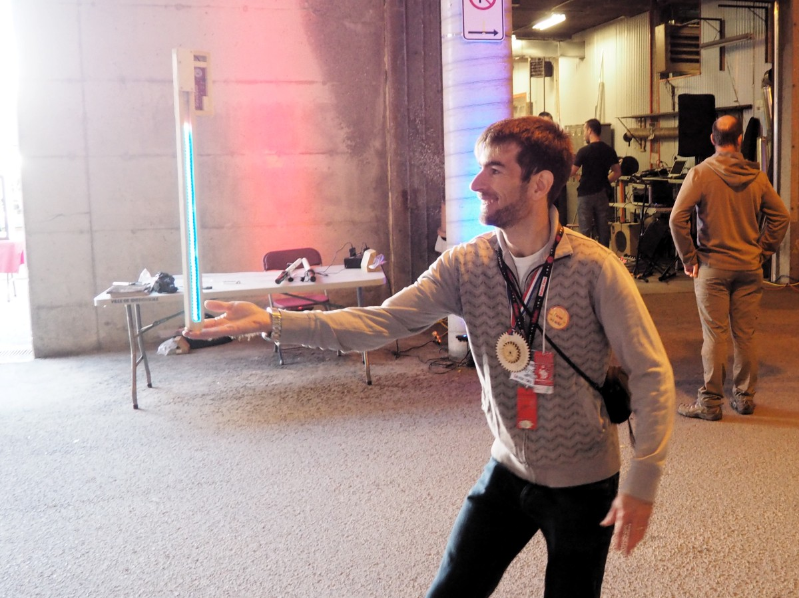
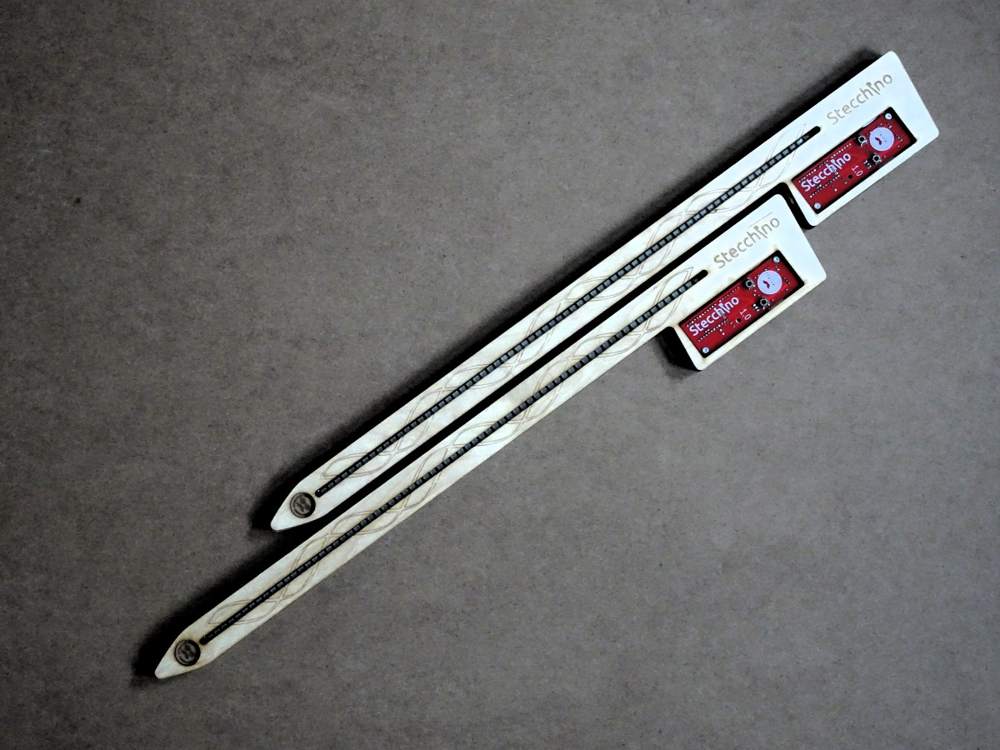
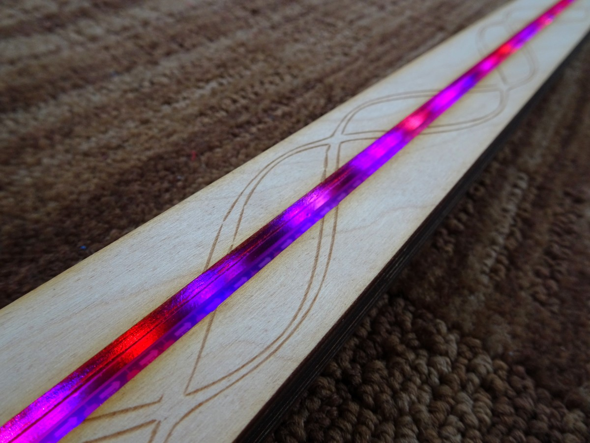

***
Stecchino is an home-made game where you need to balance a stick-like device at the tip of your fingers. The longer you can keep it balanced the more LEDs are lit on the Stecchino device. Can you do better than your friends?

***

More details, photos and videos at http://www.chezpapietmamie.com/pcube/arduino/stecchino/
***
This repo contains:
- Arduino Pro Mini sketch
- Electronic schematic, V1 PCB KiCad files and Gerbers
- Laser cut Inkscape and pdf files for V4 plywood Stecchino
Make one yourself and let me know!
***

***

***
